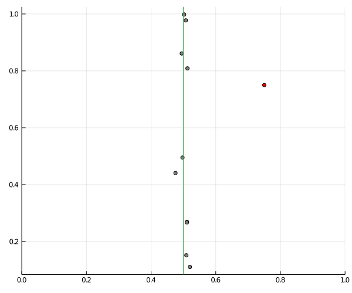
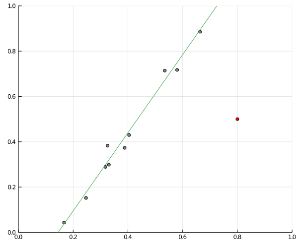
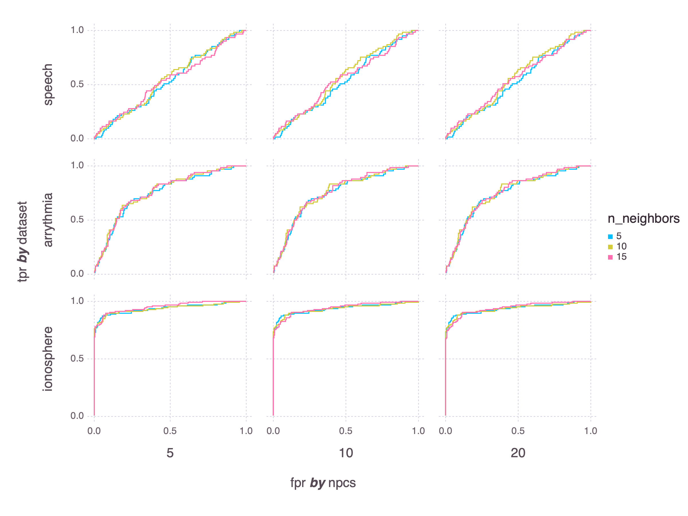

# Subspace outlier detection

This repo contains a Jupyter notebook with a Julia implementation of the outlier detection algorithm from Outlier Detection in Axis-Parallel Subspaces of High Dimensional Data, Kriegel et al., 2009.

* Original paper: [DOI](https://doi.org/10.1007/978-3-642-01307-2_86), [PDF](http://www.dbs.informatik.uni-muenchen.de/~zimek/publications/PAKDD2009/pakdd09-SOD.pdf)
* [Slides from PAKDD 2009](https://imada.sdu.dk/~zimek/publications/PAKDD2009/SOD-slides.pdf)

## Concept of SOD
For any given point, find a set of reference points, for example the nearest neighbors. Using a subset of the features, create a hyperplane along which the variance of the reference points is high. Then see how far from this hyperplane the point of interest is.

To put it another way, find the stable features for the reference points, then measure how far away the point of interest is from the reference points in these stable features. In the following image, SOD finds the green hyperplane (line), and measures the distance between the red point and the line to determine whether a point is an outlier.

At this points, I suggest a simple modification: what if we use a PCA to create a variance-maximizing hyperplane fit to the reference points, and measure the distance to the point of interest? In other words, instead of creating a hyperplane using a subset of features, we create the hyperplane using combinations of all features (using PCA).

To explain it using images, SOD, creates a hyperplane (line) along the axis that the reference point features vary the most, as in the figure above, and then measures the distance between that line and the point of interest. PCA outlier detection creates a hyperplane (line) that maximizes the variance of the reference point features:

Unlike SOD, the hyperplane does not need to be parallel to the feature axes. In theory, this makes PCA outlier detection more flexible and thus useful for a greater range of datasets.

## Results on real data
To assess the quality of the methods, I use three datasets where some points have been labeled outliers. Here are the ROC curves for SOD:

and the corresponding curves for PCAOD:

The PCA-based method seems to have a slight edge on the arrythmia and ionosphere datasets.

See the Jupyter notebook for code and further details.
