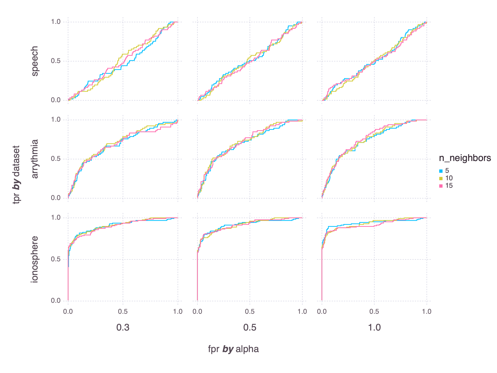

# Subspace outlier detection

This repo contains a Jupyter notebook with a Julia implementation of the outlier detection algorithm from Outlier Detection in Axis-Parallel Subspaces of High Dimensional Data, Kriegel et al., 2009.

* Original paper: [DOI](https://doi.org/10.1007/978-3-642-01307-2_86), [PDF](http://www.dbs.informatik.uni-muenchen.de/~zimek/publications/PAKDD2009/pakdd09-SOD.pdf)
* [Slides from PAKDD 2009](https://imada.sdu.dk/~zimek/publications/PAKDD2009/SOD-slides.pdf)

Results of my implementation on some real data:

I've also implemented a modified version of the method, using PCA to find the variance-maximizing hyperplane for a set of reference points.
